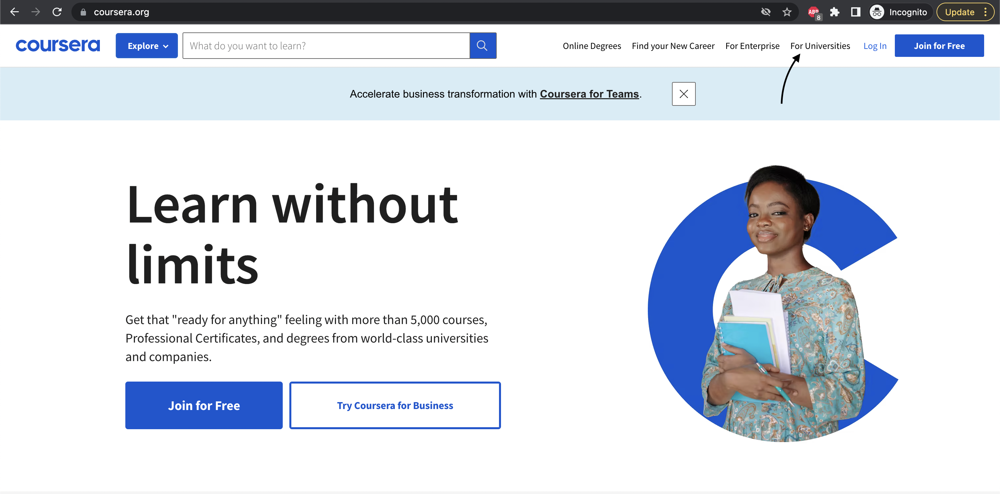
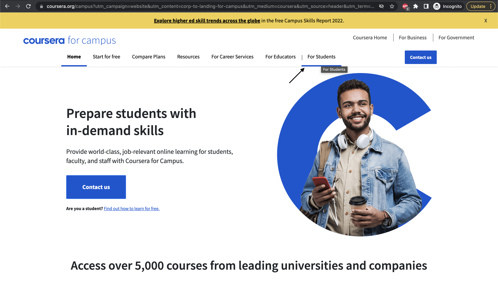
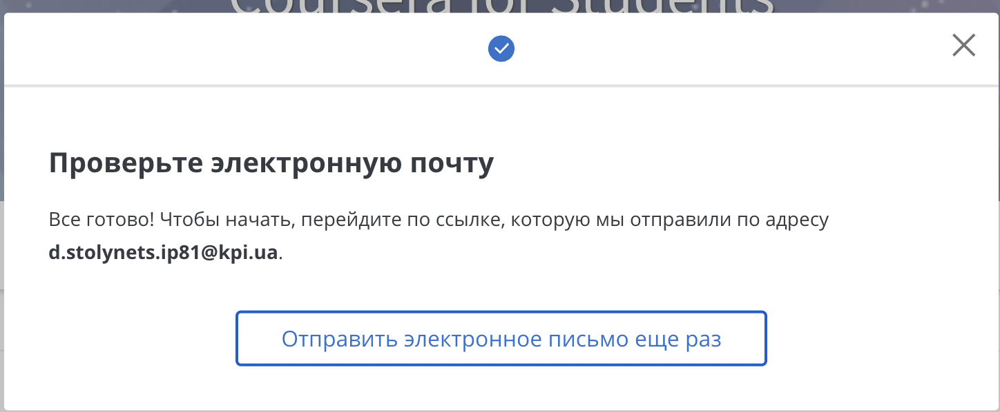
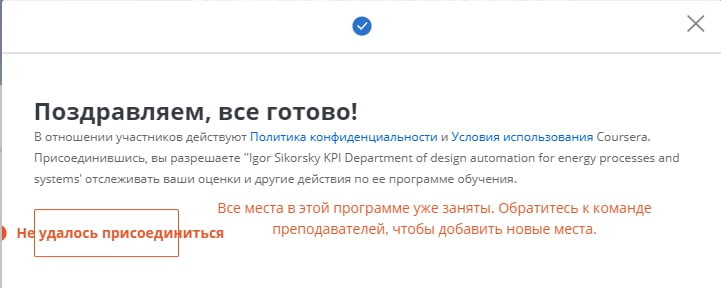

# Coursera для студентів КПІ, весна 2022.
Coursera надала можливість учням Українських ВНЗ впродовж року отримувати безкоштовний доступ до певного набору курсів платформи.

### З [офіційної статті](https://www.coursera.support/s/article/000001666-Coursera-for-Ukraine-Initiative?language=en_US) Coursera: 
> In response to the ongoing humanitarian crisis in Ukraine, Coursera is partnering with the Ministry of Education and Science of Ukraine to offer Coursera for 
Campus Basic for free to all Ukrainian higher education institutions and their students.

> Universities and colleges in Ukraine can sign up to provide all of their enrolled students with access to more than 5,200 courses and 2,200 Guided Projects 
from Coursera’s top university and industry partners at no cost.
The initiative is meant to help the higher education institutions respond to the ongoing humanitarian crisis in Ukraine and help students further pursue their education.

### Скільки часу буде доступна програма?
>This program is available from March 24, 2022 - March 24, 2023.
 
### Що я маю мати для отримання доступу? 
1. Пошту, закріплену за одним з українських ВНЗ.

### Як отримати доступ?
1. Переходимо на [головну сторінку Coursera](https://www.coursera.org/).
2. Обираємо _"For Universities"_ у меню зправа зверху для переходу до кампуса.
  
4. Обираємо _"For Students"_ у меню зправа зверху.
  
5. Вводимо пошту з домену свого ВНЗ та натискаємо _"Start"_. Робимо декілька кліків та отримуємо лист на вказану вами пошту.
  
6. Підтверджуємо адрес своєї пошти у листі та повертаємось назад до Coursera Campus, де ви вказували пошту. 
7. Coursera повинна додати підтверджену пошту до вашого акаунту.
8. Вказуємо що ви студент, проходимо до кінця і потенційно отримуємо повідомлення про те що місць на доступ до вашого ВНЗ вже немає :(
  
9. Закриваємо вікно. Насправді ж передбачені програмою курси стали для вас безкоштовні. 

### Приклад спеціалізації, що повинна стати доступною
Спеціалізація Game Design and Development with Unity 2020 : [Coursera](https://www.coursera.org/specializations/game-design-and-development#courses)

### _"Ой-ой, щось не працює(("_
Ви можете пройти процедуру реєстрації за гайдлайнами у [основній статті від Coursera](https://www.coursera.support/s/article/000001666-Coursera-for-Ukraine-Initiative?language=en_US#sign-up)